<!--
SPDX-License-Identifier: GPL-3.0-or-later
Copyright (c) 2026 Fábio Henrique de Lima Silva (fhl.bsb@gmail.com) All rights reserved.
-->

# NAM-Audio-Pipe Architecture: Low-Latency PipeWire Host

This document serves as the primary architecture bible and source of truth for **NAM-Audio-Pipe**, a low-latency, real-time standalone audio host application for [Neural Amp Modeler (NAM)](https://www.neuralampmodeler.com/) simulation on Linux using native PipeWire graphs.

NAM-Audio-Pipe embeds [`NeuralAmpModeler-rs`](https://github.com/fabiohl/NeuralAmpModeler-rs) as its core neural DSP engine, providing complete model execution (WaveNet, LSTM, ConvNet, Linear), cabinet impulse response (IR) convolution, polyphase sample rate conversion, and half-band anti-aliasing oversampling with strict **zero heap allocations**, **zero mutex locks**, and **zero blocking system calls** on the audio thread.

---

## 1. System Topology & Dual-Stream PipeWire Architecture

PipeWire's audio node graph architecture handles capture nodes (`Audio/Sink`) differently from playback streams (`Stream/Output/Audio`). Because the monitor port of a capture sink delivers audio *before* DSP processing, delivering processed sound to hardware speakers or patchbays requires a dual-stream architecture connected via a lock-free internal bridge.

```text
┌─────────────────────────────────────────────────────────────────────────────┐
│                           PipeWire Multimedia Graph                         │
└──────┬──────────────────────────────────────────────────────────────▲───────┘
       │ Audio Input (Guitar DI / Mic)                                │ Processed Audio
       ▼                                                              │
┌──────────────────────────────┐              ┌───────────────────────────────┐
│     Capture Stream / Node    │              │    Playback Stream / Node     │
│   (NAM-Audio-Pipe-input)     │              │   (NAM-Audio-Pipe-playback)   │
│   - Node: "Audio/Sink"       │              │   - Node: "Stream/Output"     │
│   - Group: "nam-audio-pipe"  │              │   - Group: "nam-audio-pipe"   │
│   - Runs DSP on Audio Thread │              │   - Reads from DspBridge      │
└──────────────┬───────────────┘              └───────────────▲───────────────┘
               │                                              │
               │ (process_dsp)                                │ (on_process)
               ▼                                              │
       ┌──────────────────────────────────────────────────────────────┐
       │                   DspBridge (Shared Memory)                  │
       │  - Double-Buffered Scratch Arrays (buf_l, buf_r)             │
       │  - Lock-Free Atomic Read/Write Generation Synchronization    │
       │  - madvise(MADV_DONTFORK | MADV_DONTDUMP)                    │
       │  - repr(align(128)) Cache-Line Isolation                     │
       └──────────────────────────────┬───────────────────────────────┘
                                      │
                                      │ (If --record active)
                                      ▼
                       ┌──────────────────────────────┐
                       │   SPSC Recording Ring Buffer │
                       │    (RingPayload::Audio/Meta) │
                       └──────────────┬───────────────┘
                                      │
                                      ▼
                       ┌──────────────────────────────┐
                       │  Disk I/O Worker Thread      │
                       │   - tokio-uring (io_uring)   │
                       │   - Async 32-bit Float WAV   │
                       │   - 4 GiB RIFF Auto-Split    │
                       └──────────────────────────────┘
```

### 1.1 Registered PipeWire Nodes & Stream Roles

| PipeWire Object     | Registered Node Name      | Node Description                  | Media Class / Role                            |
|:------------------- |:------------------------- |:--------------------------------- |:--------------------------------------------- |
| **Capture Node**    | `NAM-Audio-Pipe-input`    | `NAM-Audio-Pipe Input`            | `Audio/Sink` (Virtual capture sink)           |
| **Capture Stream**  | `NAM-Audio-Pipe`          | Primary capture audio stream      | Receives incoming hardware/application audio  |
| **Playback Node**   | `NAM-Audio-Pipe-playback` | `NAM-Audio-Pipe Processed Output` | `Stream/Output/Audio` (Audio playback source) |
| **Playback Stream** | `NAM-Audio-Pipe-Output`   | Processed audio output stream     | Emits processed audio to hardware/patchbay    |

### 1.2 Graph Scheduling Synchronization

Both streams are bound to:

- `node.group = "nam-audio-pipe-dsp"`
- `node.link-group = "nam-audio-pipe-link-group"`

This configuration ensures the PipeWire graph scheduler executes both capture and playback callbacks synchronously on the same real-time driver loop thread (`nam-audio-pipe-loop`), avoiding scheduling jitter and inter-thread synchronization overhead.

---

## 2. Memory Architecture & Lock-Free Bridge (`DspBridge`)

The shared memory bridge (`src/standalone/pw_host/bridge.rs`) facilitates lock-free audio transfer between the capture callback (which executes neural inference) and the playback callback (which copies processed buffers to hardware).

```text
┌─────────────────────────────────────────────────────────────────────────────┐
│                          DspBridge Memory Layout                            │
├─────────────────────────────────────────────────────────────────────────────┤
│  #[repr(align(128))] buffers: [BridgeBuffer; 2]                             │
│    - BridgeBuffer 0: buf_l: [f32; 8192], buf_r: [f32; 8192], n_samples: u32 │
│    - BridgeBuffer 1: buf_l: [f32; 8192], buf_r: [f32; 8192], n_samples: u32 │
├─────────────────────────────────────────────────────────────────────────────┤
│  active_read_idx: AtomicUsize                                               │
│  generation:      AtomicU64                                                 │
│  consumed_gen:    AtomicU64                                                 │
│  dropped_frames:  AtomicU32                                                 │
└─────────────────────────────────────────────────────────────────────────────┘
```

### 2.1 Double Buffering & Cache Isolation

- **Zero-Copy Double Buffering:** `DspBridge` contains two independent `BridgeBuffer` slots (`MAX_BRIDGE_BUF = 8192` samples). The capture stream writes to `buffers[1 - active_idx]` and flips `active_read_idx` using `Ordering::Release`. The playback stream loads `active_read_idx` using `Ordering::Acquire` and reads without mutex locking.
- **Cache-Line Isolation (`#[repr(align(128))]`) & Page Alignment:** The struct is internally aligned to 128 bytes to isolate cache lines and prevent CPU cache-line bouncing (False Sharing). It is allocated via a page-aligned layout (4096 bytes) to satisfy Linux kernel requirements for virtual memory operations.
- **Kernel Memory Advisories:**
  - `madvise(MADV_DONTFORK)` — Prevents Copy-on-Write memory duplication overhead if helper child processes are spawned.
  - `madvise(MADV_DONTDUMP)` — Excludes large DSP scratch memory from core dump files to preserve system disk space during debugging.

---

## 3. Threading Model & Hard Real-Time Contracts

NAM-Audio-Pipe enforces strict thread segregation across three distinct execution domains:

```text
┌─────────────────────────────────────────────────────────────────────────────┐
│                                Main Thread                                  │
│  - CLI Parsing & Model/IR Loading                                           │
│  - PipeWire Initialization & Shutdown                                       │
│  - Off-RT Resampler / CabSim Rebuild                                        │
│  - Housekeeping & SPSC GC Drain (drain_gc_channels)                          │
│  - Telemetry Polling (poll_rt_status @ 10 Hz)                               │
└──────┬──────────────────────────────┬───────────────────────────────┬───────┘
       │                              │                               │
       │ SPSC Command Channels        │ Atomic Telemetry              │ SPSC Audio Ring
       ▼                              ▼                               ▼
┌─────────────────────────────┐┌──────────────────────────────┐┌──────────────┐
│  Audio Thread (RT Callback) ││       RtStatusFlags          ││ Recording I/O│
│  - PipeWire thread_loop     ││  - Sample Rate & Latency     ││  - tokio-uring│
│  - Strict RT Safety Contract││  - CPU Cycles per Quantum    ││  - Disk Write│
│  - Neural Inference & DSP   ││  - Gate State & Overloads    ││  - WAV Split │
└─────────────────────────────┘└──────────────────────────────┘└──────────────┘
```

### 3.1 Hard Real-Time Contract (Audio Thread)

The audio callback thread (`nam-audio-pipe-loop`) executes with hard real-time determinism:

1. **Zero Heap Allocations:** All scratch buffers, resamplers, neural layer weights, and convolution engines are pre-allocated during initialization or swapped via SPSC pointers.
2. **Zero Mutex Locks:** Inter-thread communication uses wait-free SPSC channels (`rtrb`) and atomic memory primitives.
3. **Zero Blocking I/O:** File operations, standard output printing, and logging macros (`log::*`) are strictly prohibited in the RT callback. State transitions are signaled via atomic bitmasks (`RtStatusFlags`).
4. **Zero Stack Unwinding Panics:** Array index bounds checks are eliminated statically or clamped safely. Any unexpected failure sets emergency atomic flags.

---

## 4. Linux Real-Time & Kernel Tuning Layer (`rt_setup`)

To guarantee glitch-free audio processing at quantum sizes down to 64 samples (1.33 ms deadline at 48 kHz), NAM-Audio-Pipe configures Linux kernel subsystems on startup (`src/standalone/rt_setup/`):

### 4.1 CPU Core Affinity (`affinity.rs`)

- Automatically queries system CPU topology (`/sys/devices/system/cpu/`) via `select_optimal_cpu()`.
- Binds the PipeWire real-time loop thread to an isolated non-boot CPU core, avoiding IRQ interruptions and scheduler migrations.
- Issues IRQ balancing advisories (`sys.emit_irq_advisory(target_cpu)`) to alert maintainers if system hardware interrupts share the audio core.

### 4.2 Power Management QoS Latency Pinning (`pm_qos.rs`)

- Opens Linux power management interface `/dev/cpu_dma_latency` and writes `0` (target 0 µs C-state latency).
- Prevents CPU cores from entering deep sleep states (C-states: C1, C6, C8), eliminating CPU wake-up latency penalties when processing intermittent audio blocks.

### 4.3 Memory Paging Lock (`thread.rs`)

- Invokes `libc::mlockall(libc::MCL_CURRENT | libc::MCL_FUTURE)`.
- Locks the entire application virtual memory space in physical RAM, preventing the Linux kernel virtual memory subsystem from swapping audio execution pages to disk.

### 4.4 Transparent Huge Pages (THP) Disablement

- Executes `prctl(PR_SET_THP_DISABLE, 1, 0, 0, 0)`.
- Prevents background kernel `khugepaged` memory compaction sweeps from causing latency spikes during audio processing.

### 4.5 TSC Clock Calibration (`tsc.rs`)

- Calibrates the CPU Time Stamp Counter (`rdtsc`) against the monotonic clock to measure real-time DSP cycle consumption with sub-nanosecond precision.

---

## 5. Lock-Free SPSC Channels & 3-Tier GC Cascade

Inter-thread communication between the non-RT Main Thread and the RT Audio Thread is coordinated through dedicated single-producer single-consumer (`rtrb`) channels:

```text
┌─────────────────────────────────────────────────────────────────────────────┐
│                           SPSC Channel Topology                             │
├─────────────────────────────────────────────────────────────────────────────┤
│  param_channel:     Consumer<ParamPayload>       (Gains, Bypass, Modes)     │
│  resampler_channel: Consumer<Box<NamResampler>>  (Off-RT Rebuilt Resamplers)│
│  cabsim_channel:    Consumer<Option<CabSimAdapter>> (Off-RT Rebuilt IRs)    │
│  slimmable_channel: Consumer<Option<Box<StaticModel>>> (A2 Submodels)       │
│  os_channel:        Consumer<Box<OsEnginePair>>  (Oversampling Engines)     │
│  gc_channel:        Producer<GcItem>             (Replaced Asset Dealloc)   │
└─────────────────────────────────────────────────────────────────────────────┘
```

### 5.1 Three-Tier Garbage Collection Cascade

When models, impulse responses, or resamplers are hot-swapped during playback, dropping complex heap structures directly on the audio thread would trigger allocator locks. Deallocation cascades through three tiers (`NeuralAmpModeler-rs/src/common/spsc/gc.rs`):

```text
RT Thread (Replaced Asset)
       │
       ▼
[Tier 1: SPSC gc_tx (32 slots)] ──────► Drained by Main Thread (10 Hz poll)
       │ (if full)
       ▼
[Tier 2: RT Parking Lot (16 slots)] ──► Flushed to SPSC on next block;
       │                                Single-owner handoff on shutdown
       │ (if full)
       ▼
[Tier 3: GcOverflowBuffer Atomic Ring] ──► Controlled Leak + Sets RT_STATUS_GC_OVERFLOW
```

1. **Tier 1 (SPSC GC Queue):** Pushed to `gc_tx` (32 slots). Main thread drains and deallocates items during its 100 ms control loop via `drain_gc_channels`.
2. **Tier 2 (RT Parking Lot):** Fixed array `[Option<GcItem>; 16]` allocated in main thread stack and accessed via raw pointer by the RT callback. Parked items are retried each audio block; during shutdown, `thread_loop.stop()` halts the audio thread and hands `rt_parking_lot` by mutable reference to the final main-thread drain.
3. **Tier 3 (Atomic Ring Buffer):** `GcOverflowBuffer` prevents unbounded allocation leaks under severe overload while ensuring the RT audio deadline is never breached.

---

## 6. DSP Audio Processing Signal Chain

The audio callback (`src/standalone/pw_host/rt_callback/process.rs`) executes the neural signal processing pipeline on every incoming audio buffer:

```mermaid
graph TD
    PWInput[/"PipeWire Capture Buffer"/] --> SubnormalCheck["Enable FTZ & DAZ\n(SSE Control Register)"]
    SubnormalCheck --> SPSCDrain["Drain SPSC Channels\n(Gains, Model, CabSim, OS)"]
    SPSCDrain --> InGain["Input Gain Stage\n(SIMD Vectorized + ParamSmoother)"]
    InGain --> Dither["Anti-Subnormal Dither\n(-220 dBFS)"]

    Dither --> GateFSM{"Universal Noise Gate\n(Envelope Detector & State Machine)"}
    GateFSM -->|"Gate Closed (Silence)"| MuteOutput["Zero Working Buffer"]
    GateFSM -->|"Gate Open"| RateCheck{"Sample Rate == 48kHz?"}

    RateCheck -->|"No"| ResampleUp["NamResampler\n(Host Rate -> 48kHz Native)"]
    RateCheck -->|"Yes"| Inference
    ResampleUp --> Inference["Neural Inference Stage (NamModel::process)\n- WaveNet A1/A2, LSTM, ConvNet, Linear\n- Half-Band Oversampling (2x / 4x)\n- Activation Precision (Standard vs Fast)"]

    Inference --> RateDownCheck{"Sample Rate == 48kHz?"}
    RateDownCheck -->|"No"| ResampleDown["NamResampler\n(48kHz Native -> Host Rate)"]
    RateDownCheck -->|"Yes"| OutputStage
    ResampleDown --> OutputStage

    MuteOutput --> OutputStage["Output Stage\n- Dither Compensation\n- Linear Gate Fade Ramp\n- Adaptive Compute Monitoring"]

    OutputStage --> CabCheck{"Cabinet IR Loaded?"}
    CabCheck -->|"Yes"| CabConv["UPOLS CabSim Convolution\n(ConvEngine::process)"]
    CabCheck -->|"No"| OutGain
    CabConv --> OutGain["Output Gain Stage + Hard Clip\n(SIMD Vectorized + ParamSmoother)"]

    OutGain --> BridgeWrite["Write Processed Audio to DspBridge\n(Double-Buffered Float32)"]
    OutGain --> RecCheck{"--record Enabled?"}
    RecCheck -->|"Yes (n_pw > 0)"| RecEnqueue["Enqueue to SPSC Recording Ring\n(Silence Trimmed by Gate)"]
    RecCheck -->|"No / Silence"| Telemetry
    RecEnqueue --> Telemetry["Update Atomic Telemetry\n(RtStatusFlags, CPU Cycles, Peaks)"]
```



### 6.1 Universal Noise Gate & Silence Trimming

The Noise Gate FSM is active across **all operational modes** (with or without neural models or cabinet IRs). It continuously tracks the RMS signal envelope and applies smooth linear gain ramps:

- **Zero Playing Residual Noise:** Silences amp model idle hiss and electromagnetic pickup hum when the musician pauses.
- **Recording Silence Trimming:** Only audio blocks processed while the gate is open (`n_pw > 0`) are forwarded to the recording queue. Background pauses are trimmed automatically without RT thread overhead.

### 6.2 Adaptive Compute (Auto-Slimming Watchdog)

For multi-profile `.namb` containers (`--slim auto`), an internal state machine monitors CPU cycle consumption per quantum:

- If processing time exceeds 80% of the quantum deadline, the engine transitions to degraded state (`DEGRADE`), dynamically swapping to a lighter submodel without audio dropouts.
- When CPU pressure stabilizes, the watchdog restores the full neural model profile.

---

## 7. Asynchronous WAV Recording Subsystem (`src/recording/`)

When launched with `--record`, NAM-Audio-Pipe captures high-fidelity 32-bit float stereo WAV files directly to disk without impacting real-time audio thread determinism:

```text
┌─────────────────────────────────────────────────────────────────────────────┐
│                           Recording Architecture                            │
├─────────────────────────────────────────────────────────────────────────────┤
│  Audio Thread (RT)                                                          │
│    - Checks gate state (n_pw > 0)                                           │
│    - Pushes RingPayload::Audio(AlignedBlock) into SPSC RingBuffer           │
├─────────────────────────────────────────────────────────────────────────────┤
│  Recording Worker Thread ("nam-recording-io")                               │
│    - tokio-uring async event loop (Linux io_uring)                          │
│    - Consumes RingPayload (Metadata, Audio, StreamStop)                     │
│    - Reuses internal I/O buffer (io_buf) to eliminate heap allocations      │
│    - Automatically splits files at 4 GiB RIFF size limit (_partN.wav)       │
│    - Graceful shutdown: push_stream_stop (200ms retry) + bounded join (5s) │
│    - Rewrites WAV header with exact data byte count & issues fsync          │
└─────────────────────────────────────────────────────────────────────────────┘
```

### 7.1 Recording Guarantees & File Integrity

- **Zero Blocking in RT:** The RT callback pushes to `rtrb::Producer<RingPayload>`. If the ring fills (e.g. disk stalled), `OVERRUN_COUNT` is incremented atomically; audio playback is never blocked.
- **Header Finalization Protocol (R-13):** During shutdown, `thread_loop.stop()` halts the audio thread first. The main thread then exclusively pushes `RingPayload::StreamStop`, waits up to 200 ms for queue delivery, and joins the I/O thread (bounded by 5 seconds). The I/O thread rewrites the initial 44-byte WAV header at offset 0 with the exact `data` byte count and executes `fsync` before file close.

---

## 8. Diagnostic Bundle & Error Catalog

NAM-Audio-Pipe integrates with the `NamLogger` ring buffer and `DiagnosticBundle` diagnostics engine:

```bash
# Capture diagnostic bundle and exit immediately
nam-audio-pipe --diagnose

# Capture diagnostic bundle with full unredacted file paths
nam-audio-pipe --diagnose-full
```

### 8.1 Error Catalog Summary (`NamErrorCode`)

Typed diagnostic error codes (`NamErrorCode`) provide structured error categorization:

| Range   | Category            | Representative Error Codes                                                                                          |
|:------- |:------------------- |:------------------------------------------------------------------------------------------------------------------- |
| `E1xxx` | Model Loading & I/O | `E1100` FILE_NOT_FOUND, `E1200` NAM_JSON_PARSE_ERROR, `E1201` NAMB_CRC32_MISMATCH, `E1300` UNSUPPORTED_ARCHITECTURE |
| `E2xxx` | Audio & Real-Time   | `E2001` DEADLINE_EXCEEDED, `E2200` RESAMPLER_BUILD_FAILED, `E2300` SCHED_FIFO_DENIED                                |
| `E3xxx` | SPSC / Lock-Free GC | `E3100` PARAM_CHANNEL_FULL, `E3101` GC_OVERFLOW, `E3102` GC_CORRUPTED                                               |
| `E4xxx` | Runtime & CLI       | `E4100` INVALID_GAIN_VALUE, `E4103` IR_LOAD_FAILED                                                                  |
| `E5xxx` | System Resources    | `E5000` OUT_OF_MEMORY                                                                                               |

---

## 9. References

- [`NeuralAmpModeler-rs`](https://github.com/fabiohl/NeuralAmpModeler-rs) — Core neural amplifier DSP inference engine.
- [PipeWire Documentation](https://docs.pipewire.org/) — PipeWire low-latency multimedia routing daemon.
- [Linux io_uring](https://kernel.dk/io_uring.pdf) — High-performance asynchronous I/O framework.
