<!--
SPDX-License-Identifier: GPL-3.0-or-later
Copyright (c) 2026 Fábio Henrique de Lima Silva (fhl.bsb@gmail.com) All rights reserved.
-->

# NAM-Audio-Pipe Architecture: Low-Latency PipeWire Host

This document serves as the primary architecture bible and source of truth for **NAM-Audio-Pipe**, a low-latency, real-time standalone audio host application for [Neural Amp Modeler (NAM)](https://www.neuralampmodeler.com/) simulation on Linux using native PipeWire graphs.

NAM-Audio-Pipe embeds [`NeuralAmpModeler-rs`](https://github.com/fabiohl/NeuralAmpModeler-rs) as its core neural DSP engine, providing complete model execution (WaveNet, LSTM, ConvNet, Linear), cabinet impulse response (IR) convolution, polyphase sample rate conversion, and half-band anti-aliasing oversampling with strict **zero heap allocations**, **zero mutex locks**, and **zero blocking system calls** on the audio thread.

---

## 1. System Topology & Dual-Stream PipeWire Architecture

PipeWire's audio node graph architecture handles capture nodes (`Audio/Sink`) differently from playback streams (`Stream/Output/Audio`). Because the monitor port of a capture sink delivers audio *before* DSP processing, delivering processed sound to hardware speakers or patchbays requires a dual-stream architecture connected via a lock-free internal bridge.

```text
┌─────────────────────────────────────────────────────────────────────────────┐
│                           PipeWire Multimedia Graph                         │
└──────┬──────────────────────────────────────────────────────────────▲───────┘
       │ Audio Input (Guitar DI / Mic)                                │ Processed Audio
       ▼                                                              │
┌──────────────────────────────┐              ┌───────────────────────────────┐
│     Capture Stream / Node    │              │    Playback Stream / Node     │
│   (NAM-Audio-Pipe-input)     │              │   (NAM-Audio-Pipe-playback)   │
│   - Node: "Audio/Sink"       │              │   - Node: "Stream/Output"     │
│   - Group: "nam-audio-pipe"  │              │   - Group: "nam-audio-pipe"   │
│   - Runs DSP on Audio Thread │              │   - Reads from DspBridge      │
└──────────────┬───────────────┘              └───────────────▲───────────────┘
               │                                              │
               │ (process_dsp)                                │ (on_process)
               ▼                                              │
       ┌──────────────────────────────────────────────────────────────┐
       │                   DspBridge (Shared Memory)                  │
       │  - Double-Buffered Scratch Arrays (buf_l, buf_r)             │
       │  - Lock-Free Atomic Read/Write Generation Synchronization    │
       │  - madvise(MADV_DONTFORK | MADV_DONTDUMP)                    │
       │  - repr(align(128)) Cache-Line Isolation                     │
       └──────────────────────────────┬───────────────────────────────┘
                                      │
                                      │ (If --record active)
                                      ▼
                       ┌──────────────────────────────┐
                       │   SPSC Recording Ring Buffer │
                       │    (RingPayload::Audio/Meta) │
                       └──────────────┬───────────────┘
                                      │
                                      ▼
                       ┌──────────────────────────────┐
                       │  Disk I/O Worker Thread      │
                       │   - tokio-uring (io_uring)   │
                       │   - Async 32-bit Float WAV   │
                       │   - 4 GiB RIFF Auto-Split    │
                       └──────────────────────────────┘
```

### 1.1 Registered PipeWire Nodes & Stream Roles

| PipeWire Object     | Registered Node Name      | Node Description                  | Media Class / Role                            |
|:------------------- |:------------------------- |:--------------------------------- |:--------------------------------------------- |
| **Capture Node**    | `NAM-Audio-Pipe-input`    | `NAM-Audio-Pipe Input`            | `Audio/Sink` (Virtual capture sink)           |
| **Capture Stream**  | `NAM-Audio-Pipe`          | Primary capture audio stream      | Receives incoming hardware/application audio  |
| **Playback Node**   | `NAM-Audio-Pipe-playback` | `NAM-Audio-Pipe Processed Output` | `Stream/Output/Audio` (Audio playback source) |
| **Playback Stream** | `NAM-Audio-Pipe-Output`   | Processed audio output stream     | Emits processed audio to hardware/patchbay    |

### 1.2 Graph Scheduling Synchronization

Both streams are bound to:

- `node.group = "nam-audio-pipe-dsp"`
- `node.link-group = "nam-audio-pipe-link-group"`

This configuration ensures the PipeWire graph scheduler executes both capture and playback callbacks synchronously on the same real-time driver loop thread (`nam-audio-pipe-loop`), avoiding scheduling jitter and inter-thread synchronization overhead.

---

## 2. Memory Architecture & Lock-Free Bridge (`DspBridge`)

The shared memory bridge (`src/standalone/pw_host/bridge.rs`) facilitates lock-free audio transfer between the capture callback (which executes neural inference) and the playback callback (which copies processed buffers to hardware).

```text
┌─────────────────────────────────────────────────────────────────────────────┐
│                          DspBridge Memory Layout                            │
├─────────────────────────────────────────────────────────────────────────────┤
│  #[repr(align(128))] buffers: [BridgeBuffer; 2]                             │
│    - BridgeBuffer 0: buf_l: [f32; 8192], buf_r: [f32; 8192], n_samples: u32 │
│    - BridgeBuffer 1: buf_l: [f32; 8192], buf_r: [f32; 8192], n_samples: u32 │
├─────────────────────────────────────────────────────────────────────────────┤
│  active_read_idx: AtomicUsize                                               │
│  generation:      AtomicU64                                                 │
│  consumed_gen:    AtomicU64                                                 │
│  dropped_frames:  AtomicU32                                                 │
└─────────────────────────────────────────────────────────────────────────────┘
```

### 2.1 Double Buffering & Cache Isolation

- **Zero-Copy Double Buffering:** `DspBridge` contains two independent `BridgeBuffer` slots (`MAX_BRIDGE_BUF = 8192` samples). The capture stream writes to `buffers[1 - active_idx]` and flips `active_read_idx` using `Ordering::Release`. The playback stream loads `active_read_idx` using `Ordering::Acquire` and reads without mutex locking.
- **Cache-Line Isolation (`#[repr(align(128))]`) & Page Alignment:** The struct is internally aligned to 128 bytes to isolate cache lines and prevent CPU cache-line bouncing (False Sharing). To satisfy Linux kernel virtual memory alignment requirements for system advisories, it is allocated dynamically via the global allocator with a page-aligned (4096-byte) layout (`Layout::from_size_align(size, 4096.max(align_of::<DspBridge>()))` padded to align) and wrapped in a safe `BridgeRef` pointer abstraction (`src/standalone/pw_host/bridge.rs`).
- **Kernel Memory Advisories:**
  - `madvise(MADV_DONTFORK)` — Prevents Copy-on-Write memory duplication overhead if helper child processes are spawned.
  - `madvise(MADV_DONTDUMP)` — Excludes large DSP scratch memory from core dump files to preserve system disk space during debugging.

---

## 3. Threading Model & Hard Real-Time Contracts

NAM-Audio-Pipe enforces strict thread segregation across three distinct execution domains:

```text
┌─────────────────────────────────────────────────────────────────────────────┐
│                                Main Thread                                  │
│  - CLI Parsing & Model/IR Loading                                           │
│  - PipeWire Initialization & Shutdown                                       │
│  - Off-RT Resampler / CabSim Rebuild                                        │
│  - Housekeeping & SPSC GC Drain (drain_gc_channels)                          │
│  - Telemetry Polling (poll_rt_status @ 10 Hz with PollState)                 │
└──────┬──────────────────────────────┬───────────────────────────────┬───────┘
       │                              │                               │
       │ SPSC Command Channels        │ Atomic Telemetry              │ SPSC Audio Ring
       ▼                              ▼                               ▼
┌─────────────────────────────┐┌──────────────────────────────┐┌──────────────┐
│  Audio Thread (RT Callback) ││       RtStatusFlags          ││ Recording I/O│
│  - PipeWire thread_loop     ││  - Sample Rate & Latency     ││  - tokio-uring│
│  - Strict RT Safety Contract││  - CPU Cycles per Quantum    ││  - Async Disk│
│  - Neural Inference & DSP   ││  - Gate State & Overloads    ││  - Idle Sleep│
└─────────────────────────────┘└──────────────────────────────┘└──────────────┘
```

### 3.1 Hard Real-Time Contract (Audio Thread)

The audio callback thread (`nam-audio-pipe-loop`) executes with hard real-time determinism:

1. **Zero Heap Allocations:** All scratch buffers, resamplers, neural layer weights, and convolution engines are pre-allocated during initialization or swapped via SPSC pointers.
2. **Zero Mutex Locks:** Inter-thread communication uses wait-free SPSC channels (`rtrb`) and atomic memory primitives.
3. **Zero Blocking I/O:** File operations, standard output printing, and logging macros (`log::*`) are strictly prohibited in the RT callback. State transitions are signaled via atomic bitmasks (`RtStatusFlags`).
4. **Zero Stack Unwinding Panics:** Array index bounds checks are eliminated statically or clamped safely. Any unexpected failure sets emergency atomic flags.

### 3.2 Backend Lifecycle: State Machine, Fail-Fast & Bounded Reconnect

The PipeWire host lifecycle is governed by a thread-safe backend state machine (`src/standalone/pw_host/status.rs`):

- **`BackendState`** transitions: `Starting → Running → Degraded/Failed → Terminated`, plus the recoverable `Reconnecting { attempt, total_attempts, next_backoff }` state. `Failed` is **sticky** (a late `Running`/`Degraded` event never erases it) and is published through an `AtomicBool` fast-path so the main control loop observes it within its ≤ 100 ms poll (fail-fast SLA < 500 ms).
- **Stream observers** on both capture and playback map `StreamState::Error` and post-streaming `StreamState::Unconnected` (daemon crash/restart) to `Failed`.

On a fatal connectivity loss the control loop enters the **bounded reconnect cycle** (F-RB-010 / T4.5, `src/standalone/pw_host/reconnect.rs`):

1. The **DSP state** (`CaptureState`: models, resampler, cab-sim, gains, gate) and the **RT-side SPSC channels** (`RtHostChannels`) live in heap `Box`es reached via raw pointers — never moved into the stream closures. Re-instantiating the streams after a daemon restart **preserves every piece of internal state** (models, IRs, recording worker).
2. A `ReconnectCycle` (production policy: 3 attempts, progressive 250 → 500 → 1000 ms exponential backoff, total ceiling 1.75 s) hands out at most `max_attempts` backoffs and then `None` forever — the retry phase is **strictly bounded in number and time** by construction; no infinite reconnect loop can exist.
3. Each attempt re-creates a fresh `ThreadLoop`/`Context`/`Core` and both streams (the old instance is torn down first: `thread_loop.stop()`, R-04 final GC drain, `thread_configured` reset so RT setup re-runs on the new data thread).
4. On success the streams renegotiate the format and rate; the existing rebuild handlers re-sync sample rates and audio resumes. On budget exhaustion the host falls back to the **T4.4 fail-fast path**: integral teardown (RT stop, GC drain, recording `StreamStop` + bounded join) and a non-zero process exit.
5. `--fail-fast` disables the cycle entirely (first failure → immediate teardown). The backoff sleep is interruptible in 25 ms slices so SIGINT/SIGTERM is honored even while waiting for the daemon.

---

## 4. Linux Real-Time & Kernel Tuning Layer (`rt_setup`)

To guarantee glitch-free audio processing at quantum sizes down to 64 samples (1.33 ms deadline at 48 kHz), NAM-Audio-Pipe configures Linux kernel subsystems on startup (`src/standalone/rt_setup/`):

### 4.1 CPU Core Affinity (`affinity.rs`)

- Automatically queries system CPU topology (`/sys/devices/system/cpu/`) via `select_optimal_cpu()`.
- Parses `/proc/interrupts` with a streaming reader (`parse_interrupts_per_cpu()`) that extracts numeric interrupt counts mapped directly to physical CPU IDs parsed from header tokens (`CPU0`, `CPU1`, ...), returning a `HashMap<usize, u64>` without allocating monolithic string representations.
- Binds the PipeWire real-time loop thread to an isolated non-boot CPU core, avoiding IRQ interruptions and scheduler migrations.
- Issues IRQ balancing advisories (`sys.emit_irq_advisory(target_cpu)`) to alert maintainers if system hardware interrupts share the audio core.

### 4.2 Power Management QoS Latency Pinning & Hardware Sink Detection (`pm_qos.rs`)

- Opens Linux power management interface `/dev/cpu_dma_latency` and writes `0` (target 0 µs C-state latency).
- Prevents CPU cores from entering deep sleep states (C-states: C1, C6, C8), eliminating CPU wake-up latency penalties when processing intermittent audio blocks.
- **Hardware Sink Auto-Detection (`detect_hardware_sink`):** Queries `pw-metadata` to discover the default audio output sink, using a 500 ms watchdog timeout (`rx.recv_timeout`) to guard against hung daemon queries, and parsing the sink JSON (`parse_sink_name_from_metadata`) while filtering out `NAM-Audio-Pipe-input` to avoid feedback routing.

### 4.3 Memory Paging Lock (`thread.rs`)

- Invokes `libc::mlockall(libc::MCL_CURRENT | libc::MCL_FUTURE)`.
- Locks the entire application virtual memory space in physical RAM, preventing the Linux kernel virtual memory subsystem from swapping audio execution pages to disk.

### 4.4 Transparent Huge Pages (THP) Disablement

- Executes `prctl(PR_SET_THP_DISABLE, 1, 0, 0, 0)`.
- Prevents background kernel `khugepaged` memory compaction sweeps from causing latency spikes during audio processing.

### 4.5 TSC Clock Calibration (`tsc.rs`)

- Calibrates the CPU Time Stamp Counter (`rdtsc`) against the monotonic clock to measure real-time DSP cycle consumption with sub-nanosecond precision.

---

## 5. Lock-Free SPSC Channels & 3-Tier GC Cascade

Inter-thread communication between the non-RT Main Thread and the RT Audio Thread is coordinated through dedicated single-producer single-consumer (`rtrb`) channels:

```text
┌─────────────────────────────────────────────────────────────────────────────┐
│                           SPSC Channel Topology                             │
├─────────────────────────────────────────────────────────────────────────────┤
│  param_channel:     Consumer<ParamPayload>       (Gains, Bypass, Modes)     │
│  resampler_channel: Consumer<Box<NamResampler>>  (Off-RT Rebuilt Resamplers)│
│  cabsim_channel:    Consumer<Option<Box<CabSimPair>>> (Off-RT Rebuilt IRs)  │
│  slimmable_channel: Consumer<Option<Box<StaticModel>>> (A2 Submodels)       │
│  os_channel:        Consumer<Box<OsEnginePair>>  (Oversampling Engines)     │
│  gc_channel:        Producer<GcItem>             (Replaced Asset Dealloc)   │
└─────────────────────────────────────────────────────────────────────────────┘
```

### 5.1 Three-Tier Garbage Collection Cascade

When models, impulse responses, or resamplers are hot-swapped during playback, dropping complex heap structures directly on the audio thread would trigger allocator locks. Deallocation cascades through three tiers (`NeuralAmpModeler-rs/src/common/spsc/gc.rs`):

```text
RT Thread (Replaced Asset)
       │
       ▼
[Tier 1: SPSC gc_tx (32 slots)] ──────► Drained by Main Thread (10 Hz poll)
       │ (if full)
       ▼
[Tier 2: RT Parking Lot (16 slots)] ──► Flushed to SPSC on next block;
       │                                Single-owner handoff on shutdown
       │ (if full)
       ▼
[Tier 3: GcOverflowBuffer Atomic Ring] ──► Controlled Leak + Sets RT_STATUS_GC_OVERFLOW
```

1. **Tier 1 (SPSC GC Queue):** Pushed to `gc_tx` (32 slots). Main thread drains and deallocates items during its 100 ms control loop via `drain_gc_channels`.
2. **Tier 2 (RT Parking Lot):** Fixed array `[Option<GcItem>; 16]` allocated in main thread stack and accessed via raw pointer by the RT callback. An atomic dirty tracking flag (`rt_parking_lot_dirty: AtomicBool`) is updated with `Ordering::Release` whenever an asset cascades to GC and cleared once all 16 slots are drained. This avoids iterating over the 16 slots during steady-state audio callbacks when no resource swaps have occurred. During shutdown, `thread_loop.stop()` halts the audio thread and hands `rt_parking_lot` by mutable reference to the final main-thread drain.
3. **Tier 3 (Atomic Ring Buffer):** `GcOverflowBuffer` prevents unbounded allocation leaks under severe overload while ensuring the RT audio deadline is never breached.

---

## 6. DSP Audio Processing Signal Chain

The audio callback (`src/standalone/pw_host/rt_callback/process.rs`) executes the neural signal processing pipeline on every incoming audio buffer:

```mermaid
graph TD
    PWInput[/"PipeWire Capture Buffer"/] --> SubnormalCheck["Enable FTZ & DAZ\n(SSE Control Register)"]
    SubnormalCheck --> SPSCDrain["Drain SPSC Channels\n(Gains, Model, CabSim, OS)"]
    SPSCDrain --> InGain["Input Gain Stage\n(SIMD Vectorized + ParamSmoother)"]
    InGain --> Dither["Anti-Subnormal Dither\n(-220 dBFS)"]

    Dither --> GateFSM{"Universal Noise Gate\n(Envelope Detector & State Machine)"}
    GateFSM -->|"Gate Closed (Silence)"| MuteOutput["Zero Working Buffer"]
    GateFSM -->|"Gate Open"| RateCheck{"Sample Rate == 48kHz?"}

    RateCheck -->|"No"| ResampleUp["NamResampler\n(Host Rate -> 48kHz Native)"]
    RateCheck -->|"Yes"| Inference
    ResampleUp --> Inference["Neural Inference Stage (NamModel::process)\n- WaveNet A1/A2, LSTM, ConvNet, Linear\n- Half-Band Oversampling (2x / 4x)\n- Activation Precision (Standard vs Fast)"]

    Inference --> RateDownCheck{"Sample Rate == 48kHz?"}
    RateDownCheck -->|"No"| ResampleDown["NamResampler\n(48kHz Native -> Host Rate)"]
    RateDownCheck -->|"Yes"| OutputStage
    ResampleDown --> OutputStage

    MuteOutput --> OutputStage["Output Stage\n- Dither Compensation\n- Linear Gate Fade Ramp\n- Adaptive Compute Monitoring"]

    OutputStage --> CabCheck{"Cabinet IR Loaded?"}
    CabCheck -->|"Yes"| CabConv["UPOLS CabSim Convolution\n(ConvEngine::process)"]
    CabCheck -->|"No"| OutGain
    CabConv --> OutGain["Output Gain Stage + Hard Clip\n(SIMD Vectorized + ParamSmoother)"]

    OutGain --> BridgeWrite["Write Processed Audio to DspBridge\n(Double-Buffered Float32)"]
    OutGain --> RecCheck{"--record Enabled?"}
    RecCheck -->|"Yes (n_pw > 0)"| RecEnqueue["Enqueue to SPSC Recording Ring\n(Silence Trimmed by Gate)"]
    RecCheck -->|"No / Silence"| Telemetry
    RecEnqueue --> Telemetry["Update Atomic Telemetry\n(RtStatusFlags, CPU Cycles, Peaks)"]
```



### 6.1 Universal Noise Gate & Silence Trimming

The Noise Gate FSM is active across **all operational modes** (with or without neural models or cabinet IRs). It continuously tracks the RMS signal envelope and applies smooth linear gain ramps:

- **Zero Playing Residual Noise:** Silences amp model idle hiss and electromagnetic pickup hum when the musician pauses.
- **Recording Silence Trimming:** Only audio blocks processed while the gate is open (`n_pw > 0`) are forwarded to the recording queue. Background pauses are trimmed automatically without RT thread overhead.

### 6.2 Adaptive Compute (Auto-Slimming Watchdog)

For multi-profile `.namb` containers (`--slim auto`), an internal state machine monitors CPU cycle consumption per quantum:

- If processing time exceeds 80% of the quantum deadline, the engine transitions to degraded state (`DEGRADE`), dynamically swapping to a lighter submodel without audio dropouts.
- When CPU pressure stabilizes, the watchdog restores the full neural model profile.

### 6.3 Pipeline Limits & Buffer/Quantum Negotiation (G-RB-003)

The DSP pipeline has **hard, static buffer ceilings** that every input — CLI, PipeWire graph or SPA descriptor — is validated against before it can influence allocation:

| Limit | Value | Origin / Enforcement |
|:----- |:----- |:-------------------- |
| `MAX_BRIDGE_BUF` | 8192 samples | `neural_amp_modeler_rs::dsp::pipeline` — the `DspBridge` double-buffer width; the RT callbacks reject any quantum with `n_samples > MAX_BRIDGE_BUF` **fail-closed** (see §2.1) |
| `MAX_RESAMP_BUF` | 8192 samples | Same module — bounds every resampler and oversampling engine construction |
| CabSim partition | clamped to `[16, MAX_RESAMP_BUF]` | Off-RT rebuild handler (`handlers.rs`): a spurious requested partition is clamped before any `ConvEngine` instantiation, so no oversized UPOLS FFT can be built |
| `--buffer-size` domain | `{0} ∪ {2^k | 16 ≤ 2^k ≤ 8192}` | `src/standalone/cli.rs::validate_buffer_size` — pure, typed, runs before any PipeWire connection or allocation |

**Negotiation flow** (CLI → PipeWire → RT bounds → CabSim):

```text
CLI (--buffer-size N)
  │  validate_buffer_size(N): 0 | 16..8192 power-of-two, else typed
  │  BufferSizeError (exit != 0 before any graph connection)
  ▼
run.rs — capture/playback property build
  │  N == 0 (BUFFER_SIZE_AUTO)  → no node.latency → PipeWire auto-negotiation
  │  N  > 0                     → node.latency = "{N}/48000" (capture + playback)
  ▼
PipeWire graph quantum
  │  graph may also renegotiate the quantum at runtime (param_changed)
  ▼
RT callback (process_dsp) — hard bounds check
  │  n_samples > MAX_BRIDGE_BUF (8192)  → reject descriptor fail-closed,
  │                                       RT mute guard latched (contract violation)
  │  n_samples ≤ 8192                   → process DSP within the quantum budget
  ▼
Telemetry & renegotiation logging
  │  requested_buffer_frames / previous_buffer_frames (RtStatusFlags)
  ▼
handle_quantum_log (handlers.rs)
  │  new_quantum != old_quantum → "PipeWire quantum renegotiated: N -> M samples"
  ▼
Off-RT rebuild handlers (quantum/rate change)
     requested_cabsim_partition_size clamped to [16, MAX_RESAMP_BUF]
     → CabSimPair rebuilt (UPOLS partitioned convolution, FFT sized from partition)
```

The domain ceiling ties directly to the deadlines: at 48 kHz a `MAX_BRIDGE_BUF` (8192) quantum
is the 170,7 ms worst case, while the smallest certified size (16) is 0,33 ms — and a
64-sample quantum (the low-latency target) carries a 1,33 ms budget that the RT Deadline
gate (`tests/rt_metrics.rs`, `utils/tests-long.sh` Phase 3) requires the pipeline to beat
with an 85% safety margin.

---

## 7. Asynchronous WAV Recording Subsystem (`src/recording/`)

When launched with `--record`, NAM-Audio-Pipe captures high-fidelity 32-bit float stereo WAV files directly to disk without impacting real-time audio thread determinism:

```text
┌─────────────────────────────────────────────────────────────────────────────┐
│                           Recording Architecture                            │
├─────────────────────────────────────────────────────────────────────────────┤
│  Audio Thread (RT)                                                          │
│    - Checks gate state (n_pw > 0)                                           │
│    - Audio: try_acquire() slot → fill_planar in place → publish()           │
│      (preallocated pool, 4-byte descriptor; zero alloc on RT)               │
│    - Control: Metadata/StreamStop on a dedicated small control ring         │
│    - Signals recording_data_available notification flag                     │
├─────────────────────────────────────────────────────────────────────────────┤
│  Recording Worker Thread ("nam-recording-io")                               │
│    - tokio-uring async event loop (Linux io_uring)                          │
│    - Pops audio descriptors → writes the 64 KiB block IN PLACE → release()  │
│    - Applies Metadata at the stream position marked by a control barrier    │
│    - Reuses internal I/O buffer (io_buf) to eliminate heap allocations      │
│    - Enters 10ms idle sleep when channels are drained to eliminate spin     │
│    - Automatically splits files at 4 GiB RIFF size limit (_partN.wav)       │
│    - Lifecycle decoupled from SHUTDOWN (T3.4): exits only on StreamStop or  │
│      sender drop + drained channels                                        │
│    - Graceful shutdown: push_stream_stop (200ms retry) → sender drop →      │
│      bounded join (5s)                                                      │
│    - Rewrites WAV header with exact data byte count & issues fsync          │
└─────────────────────────────────────────────────────────────────────────────┘
```

### 7.0 Promoted Pool Transport (T4.2 verdict PROMOTE → integrated in T4.3)

Production recording audio travels through a **preallocated slot pool** (`src/recording/pool.rs`,
256 × ~64 KiB slots ≈ 16,8 MiB) instead of moving every 64 KiB block *by value* through an
SPSC ring. The RT thread `try_acquire`s a slot (pops a `u16` index from a free-list ring),
fills it in place (`fill_planar`) and `publish`es a 4-byte [`Descriptor`]; the I/O thread pops
the descriptor, writes the block **in place** and `release`s the index back to the free ring.
The payload is written once and read once — the inline ring moved it 7 × per quantum vs 3 ×
for the pool (~57% fewer 64 B cache lines). Measured (A/B, `recording_ab_bench`, 3 runs × 5
sizes, Ryzen 7 5700U): reproducible p99 recording-latency gain ≥ 5 % at every size
(64 f +96 %, 256 f +93 %, 512 f +92 %, 2048 f +78–84 %, 8192 f +33–44 %); cache
`cache-references` −86,7 %, `cache-misses` −77,3 %).

The pool only carries audio. `AudioMetadata` and `StreamStop` travel on a small dedicated
**control ring** (`CONTROL_CAPACITY = 4`); to preserve the RT thread's publication order under
mid-stream rate changes (header must apply between the pre-change and post-change audio), every
confirmed metadata push also deposits a **control barrier** (`slot == 0xFFFF`, an impossible
pool index) at the exact position in the pool `work`-ring FIFO — the I/O thread applies the
control message when it reaches the barrier, matching the inline ring's FIFO semantics exactly.
The wiring abstraction lives in `src/recording/transport.rs` (`RecordingSender` /
`RecordingReceiver`); the T4.1 inline ring remains fully wired behind the compile-time
`RECORDING_POOL_TRANSPORT` switch as the rollback path.

### 7.1 Recording Guarantees & File Integrity

- **Capacity Domain Closed over the Full Quantum Range (T4.1/T4.3):** The recording block is sized `MAX_BLOCK_SIZE = 16384` interleaved f32 samples (8192 stereo frames), covering the **largest legal host quantum** (`MAX_BRIDGE_BUF = 8192`). Every quantum accepted with `--record` is persisted integrally — the old hard drop ceiling (2048 frames, half of the former 4096-sample block) is gone. `POOL_CAPACITY = 256` slots × ~64 KiB = 16 MiB, the same memory footprint as the previous 1024 × 16 KiB layout with 4× deeper frame buffering. A block wider than `MAX_BLOCK_SIZE` (a spurious over-bridge quantum) is still dropped fail-closed without acquiring a slot.
- **Overrun Accounting in Blocks and Frames (T4.1/T4.3):** When the pool is exhausted (all 256 slots in flight — the pool's analog of a full ring) or a block exceeds `MAX_BLOCK_SIZE`, `OVERRUN_COUNT` (blocks) **and** `OVERRUN_FRAMES_COUNT` (frames) are incremented atomically; audio playback is never blocked. At shutdown the worker reports `blocos perdidos: N (frames: M)`, so the invariant `frames_capturados == frames_enfileirados + frames_perdidos` can be reconciled. Enqueueing is zero-alloc/zero-dealloc on the RT thread (heap-audit gated, `get_dealloc_count() == 0`).
- **Startup Handshake & Fail-Fast (F-RB-009 / T3.3):** When launched with `--record`, the main thread blocks on a `tokio::sync::oneshot` handshake until the worker confirms `io_uring` is available and the output directory is a real writable directory (`validate_output_dir` probe file). An invalid/no-permission directory or an unavailable `io_uring` aborts the process with a clear message **before** any PipeWire stream connects — recording can never fail silently while audio is discarded.
- **Runtime Failure Propagation (F-RB-009 / T3.3):** On a fatal mid-stream error (`EIO`, `ENOSPC`), the worker transitions the observable `RecordingStatus` to `Failed` and raises an atomic flag the RT callback polls to suspend enqueueing without panics; the error is logged visibly.
- **Header Finalization Protocol (R-13):** During shutdown, `thread_loop.stop()` halts the audio thread first. The main thread then exclusively pushes `ControlPayload::StreamStop` (bounded retry), explicitly drops the recording sender (control producer + pool producer), and joins the I/O thread (bounded by 5 seconds). The I/O thread rewrites the initial 44-byte WAV header at offset 0 with the exact `data` byte count and executes `fsync` before file close.
- **Lifecycle Decoupling & Integral Drain (F-RB-009 / T3.4):** The disk worker **never** observes the process-global `SHUTDOWN` flag — a SIGINT arriving while the channels are momentarily empty must not finalize the capture while the RT callback can still emit (up to one main-loop iteration). The worker terminates only when (1) it consumes the `StreamStop` token, pushed exclusively after `thread_loop.stop()` confirmed the RT loop stopped (draining every pending pool descriptor first), or (2) the sender was dropped (both producers gone) **and** every channel is fully drained. Both paths drain every pending block, rewrite the header and `fsync` before returning, so the recording tail is never truncated and the WAV is always coherent. No ABA / double-return: slot ownership is `FREE→RT→IN-FLIGHT→I/O→FREE` through two strict SPSC FIFOs.
- **RAII Worker Custody & Observable Join (F-RB-009 / T3.5):** The worker thread, its transport sender (the stop channel) and the RT failure flag travel together in a `RecordingWorkerGuard` (see `src/recording/guard.rs`). The guard owns the `JoinHandle` and the sender, so **every** exit path — normal shutdown, an early `?` return inside the host, or a panic unwinding during initialization — signals the worker (`StreamStop` → sender drop) and joins it with a bounded timeout: zero zombie threads or open WAV descriptors. The join result is formally inspected: a worker `Err` (failed header rewrite/`fsync`, `EIO`, `ENOSPC`), a panic payload or a join timeout is returned as a `RecordingWorkerOutcome` and propagated to `main()`, turning any recording failure into a **non-zero process exit code** — the old `let _ = handle.join()` that silently swallowed worker failures is gone.

---

## 8. Diagnostic Bundle & Error Catalog

NAM-Audio-Pipe integrates with the `NamLogger` ring buffer and `DiagnosticBundle` diagnostics engine:

```bash
# Capture diagnostic bundle and exit immediately
nam-audio-pipe --diagnose

# Capture diagnostic bundle with full unredacted file paths
nam-audio-pipe --diagnose-full
```

### 8.1 Error Catalog Summary (`NamErrorCode`)

Typed diagnostic error codes (`NamErrorCode`) provide structured error categorization:

| Range   | Category            | Representative Error Codes                                                                                          |
|:------- |:------------------- |:------------------------------------------------------------------------------------------------------------------- |
| `E1xxx` | Model Loading & I/O | `E1100` FILE_NOT_FOUND, `E1200` NAM_JSON_PARSE_ERROR, `E1201` NAMB_CRC32_MISMATCH, `E1300` UNSUPPORTED_ARCHITECTURE |
| `E2xxx` | Audio & Real-Time   | `E2001` DEADLINE_EXCEEDED, `E2200` RESAMPLER_BUILD_FAILED, `E2300` SCHED_FIFO_DENIED, `E2302` BACKEND_FAILURE, `E2304` SPA_FORMAT_CONTRACT_VIOLATION |
| `E3xxx` | SPSC / Lock-Free GC | `E3100` PARAM_CHANNEL_FULL, `E3101` GC_OVERFLOW, `E3102` GC_CORRUPTED                                               |
| `E4xxx` | Runtime & CLI       | `E4100` INVALID_GAIN_VALUE, `E4103` IR_LOAD_FAILED                                                                  |
| `E5xxx` | System Resources    | `E5000` OUT_OF_MEMORY                                                                                               |

---

## 9. Flatpak Packaging & Sandbox Architecture

NAM-Audio-Pipe supports standalone distribution as an isolated, high-performance Flatpak application targeting `io.github.fabiohl.NAMAudioPipe` on runtime `org.freedesktop.Platform//25.08`:

### 9.1 Sandbox Topology & Low-Latency Audio IPC

Executing real-time DSP applications inside an unprivileged Linux container sandbox requires deterministic, low-latency communication channels with the host kernel and PipeWire daemon:

```text
┌─────────────────────────────────────────────────────────────────────────────┐
│                           Flatpak Application Sandbox                       │
│                        (io.github.fabiohl.NAMAudioPipe)                     │
├─────────────────────────────────────────────────────────────────────────────┤
│  Binary: /app/bin/nam-audio-pipe                                            │
│  DSP Loop: Hard RT Determinism, SPSC Queues, DspBridge Double Buffering     │
│  Model Loader: Reads from ~/ via --filesystem=home:ro                       │
└──────┬──────────────────────────────┬───────────────────────────────┬───────┘
       │                              │                               │
       │ xdg-run/pipewire-0 Socket    │ POSIX memfd_create (--share=ipc)│ PM QoS (/dev/cpu_dma_latency)
       ▼                              ▼                               ▼
┌─────────────────────────────┐┌──────────────────────────────┐┌───────────────┐
│    PipeWire Host Daemon     ││  Zero-Copy Audio Buffers     ││ Linux Kernel  │
│  - Driver loop scheduling   ││  - Direct shared memory pages││ - 0 µs C-state│
│  - Node graph auto-routing  ││  - Zero context switch alloc ││ - DMA latency │
└─────────────────────────────┘└──────────────────────────────┘└───────────────┘
```

#### Detailed Sandbox Grants & Rationale

- **PipeWire Unix Domain Socket (`--filesystem=xdg-run/pipewire-0`):** Provides a direct Unix socket connection to the user's host PipeWire session daemon. Bypasses emulation layers, enabling native quantum scheduling down to 64 samples (1.33 ms).
- **POSIX Shared Memory & IPC (`--share=ipc`):** Grants access to `memfd_create` and POSIX shared memory primitives. Required by PipeWire SPA (Simple Plugin API) buffers to achieve zero-copy audio stream transfer between the sandbox process and the host daemon.
- **Audio & DMA Device Access (`--device=all`):** Grants access to `/dev/snd/*` devices and the Linux Power Management QoS interface `/dev/cpu_dma_latency`, allowing the real-time thread tuning layer (`rt_setup`) to pin CPU DMA latency to 0 µs and prevent C-state wake-up stutter.
- **Read-Only Model Storage (`--filesystem=home:ro`):** Allows resolving and loading `.nam`/`.namb` neural amp models and `.wav` impulse responses from anywhere in the user's `$HOME` directory without write exposure.
- **Display & Fallback Sockets (`--socket=wayland`, `--socket=fallback-x11`, `--socket=pulseaudio`):** Ensures interoperability with desktop environments and fallback sound servers.

### 9.2 Desktop Integration & AppStream Metadata

The packaging directory (`packaging/flatpak/`) provides standard XDG desktop integration assets:

- **Desktop Entry (`io.github.fabiohl.NAMAudioPipe.desktop`):** Registers `NAM-Audio-Pipe` in application menus under the `Audio;AudioVideo;` categories with terminal execution support (`Terminal=true`).
- **AppStream Metainfo (`io.github.fabiohl.NAMAudioPipe.metainfo.xml`):** Provides catalog metadata for graphical package managers (GNOME Software, KDE Discover), documenting capabilities, URLs, release tags, and developer identity (`io.github.fabiohl`).
- **Hicolor Icon Hierarchy (`icons/hicolor/`):** Full icon suite including scalable vector (`scalable/apps/io.github.fabiohl.NAMAudioPipe.svg`) and high-resolution rasterized assets (`64x64`, `128x128`, `256x256`, `512x512` PNGs generated via `render-icons.py`).

### 9.3 Flatpak Manifest Specification (`io.github.fabiohl.NAMAudioPipe.yml`)

The Flatpak manifest defines the standalone application package targeting `org.freedesktop.Platform//25.08`:

```yaml
id: io.github.fabiohl.NAMAudioPipe
runtime: org.freedesktop.Platform
runtime-version: "25.08"
sdk: org.freedesktop.Sdk//25.08
command: nam-audio-pipe

finish-args:
  - --socket=pipewire
  - --share=ipc
  - --device=all
  - --filesystem=home:ro
  - --socket=fallback-x11
  - --socket=wayland

modules:
  - name: nam-audio-pipe
    buildsystem: simple
    build-commands:
      - install -Dm755 nam-audio-pipe ${FLATPAK_DEST}/bin/nam-audio-pipe
      - install -Dm644 io.github.fabiohl.NAMAudioPipe.desktop ${FLATPAK_DEST}/share/applications/io.github.fabiohl.NAMAudioPipe.desktop
      - install -Dm644 io.github.fabiohl.NAMAudioPipe.metainfo.xml ${FLATPAK_DEST}/share/metainfo/io.github.fabiohl.NAMAudioPipe.metainfo.xml
      - install -Dm644 icons/hicolor/scalable/apps/io.github.fabiohl.NAMAudioPipe.svg ${FLATPAK_DEST}/share/icons/hicolor/scalable/apps/io.github.fabiohl.NAMAudioPipe.svg
      - install -Dm644 icons/hicolor/64x64/apps/io.github.fabiohl.NAMAudioPipe.png ${FLATPAK_DEST}/share/icons/hicolor/64x64/apps/io.github.fabiohl.NAMAudioPipe.png
      - install -Dm644 icons/hicolor/128x128/apps/io.github.fabiohl.NAMAudioPipe.png ${FLATPAK_DEST}/share/icons/hicolor/128x128/apps/io.github.fabiohl.NAMAudioPipe.png
      - install -Dm644 icons/hicolor/256x256/apps/io.github.fabiohl.NAMAudioPipe.png ${FLATPAK_DEST}/share/icons/hicolor/256x256/apps/io.github.fabiohl.NAMAudioPipe.png
      - install -Dm644 icons/hicolor/512x512/apps/io.github.fabiohl.NAMAudioPipe.png ${FLATPAK_DEST}/share/icons/hicolor/512x512/apps/io.github.fabiohl.NAMAudioPipe.png
```

### 9.4 Integrated Release Pipeline (`build-release.sh`)

Flatpak packaging is embedded directly into Phase 7 of `utils/build-release.sh`:

1. **Environment Initialization:** Runs `flatpak build-init` configuring `org.freedesktop.Sdk//25.08` (falling back to `org.freedesktop.Platform` if SDK is uninstalled).
2. **Artifact Installation:** Installs optimized binary, desktop entry, AppStream XML, hicolor icon hierarchy, and GPL-3.0 license. The desktop entry, metainfo and icon theme are **mandatory** — any missing file aborts the release (fail-closed).
3. **AppStream Validation:** Runs `appstreamcli validate --no-net --strict` against the metainfo and refuses to export a Flatpak with structural or semantic errors.
4. **Catalog Payload Synthesis:** Generates the per-app `share/app-info` payload (AppStream XML + icons, the `appstream-compose` equivalent) so `flatpak build-export --update-appstream` aggregates a real, indexable catalog instead of emitting "No appstream data".
5. **Sandbox Finalization:** Applies `flatpak build-finish` with sandbox grants (`--socket=pipewire`, `--share=ipc`, `--device=all`, `--filesystem=home:ro`, `--socket=wayland`, `--socket=fallback-x11`).
6. **OSTree Repository Export:** Runs `flatpak build-export --update-appstream` and verifies the AppStream catalog refs were synthesized inside the OSTree repository (fail-closed on "No appstream data").
7. **Bundle Export & Smoke Test:** Runs `flatpak build-bundle` outputting `~/nam-audio-pipe-v<VERSION>-linux-x86_64-v3.flatpak`, then imports the bundle into a fresh temporary OSTree repository to verify its integrity and manifest (`command=nam-audio-pipe`).
8. **Automated User Installation:** If `--install` is supplied, registers and installs the package locally (`flatpak install --user --reinstall -y`) and runs an in-sandbox `flatpak run --command=nam-audio-pipe ... --diagnose` smoke test.

### 9.5 Developer Build & Sandbox Inspection Commands

```bash
# 1. Automated build of optimized binary and Flatpak bundle:
./utils/build-release.sh --install

# 2. Standalone compilation using flatpak-builder:
cargo build --release
flatpak-builder --user --install --force-clean \
  --state-dir=target/flatpak-builder \
  target/flatpak-build \
  packaging/flatpak/io.github.fabiohl.NAMAudioPipe.yml

# 3. Run containerized diagnostics:
flatpak run io.github.fabiohl.NAMAudioPipe --diagnose

# 4. Run containerized live DSP stream with custom model and buffer size:
flatpak run io.github.fabiohl.NAMAudioPipe \
  --model ~/models/amp.nam \
  --cab ~/irs/cab.wav \
  --buffer-size 64

# 5. Remove Flatpak application:
flatpak uninstall --user io.github.fabiohl.NAMAudioPipe
```

---

## 10. References

- [`NeuralAmpModeler-rs`](https://github.com/fabiohl/NeuralAmpModeler-rs) — Core neural amplifier DSP inference engine.
- [PipeWire Documentation](https://docs.pipewire.org/) — PipeWire low-latency multimedia routing daemon.
- [Linux io_uring](https://kernel.dk/io_uring.pdf) — High-performance asynchronous I/O framework.
